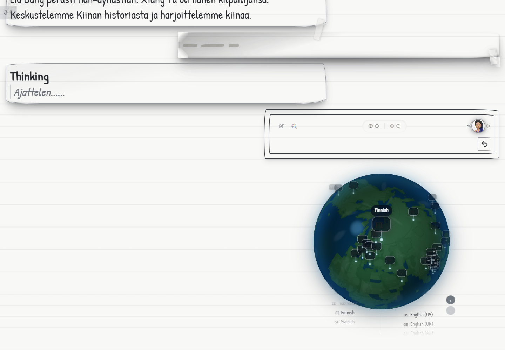

# Live latency and concealed speech feedback

The pending user row shows decorative ink marks while waiting for Gemini's
transcript. Whisper's provisional words stay out of the displayed and committed
transcript. Confirmed microphone speech adds roughly one mark per second, up to
24; silence does not grow the marks. There is no animation loop. The provider
transcript replaces the ink and retains the normal message playback controls.

Both observer-triggered and camera-started turns use this feedback. Pre-connect
capture continues updating it; replaying that buffered capture does not count
the same speech twice. Initial paid-session authorization, audio pacing, the
one-turn limit, billing, and end-of-turn handling are unchanged.

## Measurement from the supplied recording

[Sanitized evidence](evidence/live-ui-latency-20260905.json) comes from an isolated
headless Chrome running the full application against the staging backend on
5 September 2026, Helsinki time. The 9.92-second recording was supplied through
Chrome's fake microphone. Twenty seconds of initial silence allows startup;
trailing silence prevents the file looping into another paid turn. The test uses
real Whisper, the application's context builder, the managed gateway, Gemini,
the transcript UI, and the playback worklet. It seeds 240 synthetic history
messages; the generated instruction in this run contained 10,181 characters.
This is not the owner's exact production history or a physical speaker test.

| Interval in the completed UI turn | Duration |
| --- | ---: |
| Whisper trigger to first Gemini input transcript | 5.70 s |
| Whisper trigger to first playback notification | 22.03 s |
| Last detected capture speech to input close beginning | 6.39 s |
| Input close beginning to audio queue drained / boundary sent | 5.55 s |
| Boundary sent to first response audio received | 4.12 s |
| First response audio received to playback notification | 0.008 s |
| Total last detected capture speech to first playback notification | 16.07 s |
| Ticket admission | 0.45 s |
| Context construction after speech trigger | 0.001 s |

The queue held 5.60 seconds of audio when closing began. On the matching gateway
session, maximum input message queue wait was 0.313 ms. Gateway boundary forwarding
to first provider audio took 4.04 seconds. Subtracting that duration from the
browser's corresponding 4.12-second interval leaves about 80 ms for the remaining
transport and client processing in this interval; this is not a standalone RTT
measurement. Cross-machine absolute timestamps were not subtracted.

The primary delays in this sample were local boundary waiting, the browser audio
backlog, and provider generation. A later Whisper confirmation can move the
four-second idle/post-roll deadline beyond the last audible speech. This release
makes those waits measurable; it does not shorten the safety tail or accelerate
audio delivery. One sample is not a production percentile or a region-migration
benchmark. The first Gemini transcript arrived while the final recorded speech
was still ending in this run, unlike the user's earlier production observation.

The full-app check verified growing marks (3 through 8, approximately one update
per second), no provisional text in the placeholder, the final word "minulle",
242 messages after the completed exchange, playback drain, no page errors, and
successful export plus restoration after page reload. Three earlier synthetic
headless replays also passed pacing and billing checks; they are narrower tests
and are not used to claim full-UI latency.

The matching managed session settled once for 11 credits (the app's recorded
provider-cost estimate was $0.01081), with zero remaining reserved credits,
one provider turn, and zero camera frames.



## Diagnostics and retention

Open Traffic Log and choose **Export turn timings**. The app keeps up to 30
reports, with up to 120 events each, in local browser storage. Writes are batched
once per second and flushed when the page hides. Clear logs also clears timing
history. Storage denial or quota exhaustion does not interrupt the conversation.
Timing records contain event names, numeric measurements, random turn/session
identifiers, and a start date; they do not contain audio, transcripts, prompts,
API keys, or auth tokens. The existing content-bearing traffic log remains
memory-only.

Browser/Node reports use a client monotonic clock; gateway reports use a separate
gateway monotonic clock. Match `gatewaySessionId` to the gateway's `sessionId`.
Compare durations within each clock, not absolute offsets between machines.
The playback worklet notification is evidence that rendering started, not a
measurement of the physical device's output latency. Energy/Whisper timestamps
are detection timestamps, not a guaranteed exact speech endpoint.

Cloud Logging filter for gateway timing reports:

```text
resource.type="cloud_run_revision"
resource.labels.service_name="maestrotutor-live-gateway"
jsonPayload.message="Live turn timing"
```

## Reproduce the full-app test

1. Use staging test credentials and its registered App Check debug token. Set
   `VITE_FIREBASE_APPCHECK_DEBUG_TOKEN` only in the local test server environment.
   Run `npm run dev -- --mode staging --host localhost --port 5173 --strictPort`.
   Staging permits that localhost origin; do not broaden production CORS.
2. Convert the supplied recording to a mono 48 kHz WAV, with 20 seconds of leading
   silence and at least 150 seconds trailing silence. Keep the recording outside
   committed files. Set its path in `MAESTRO_UI_REPLAY_WAV`.
3. Set `MAESTRO_FIREBASE_EMAIL` and `MAESTRO_FIREBASE_PASSWORD` to the dedicated
   staging test identity. Run `npm run test:live:ui` with Chrome installed.
4. Inspect `.maestro-debug/full-ui-replay/evidence.json`, `export.json`, and the
   before/after screenshots. The command fails if the final word, growing empty
   placeholder, playback drain, long history, export, or reload check is missing.
5. Correlate the gateway log, inspect billing settlement, and stop the local test
   server. No test credentials or audio should be committed.

The fixture module is development-only and rejects non-staging configuration.
It is not imported into production. The runner creates an isolated Chrome
context and never accesses the user's Chrome profile or production session.

## Release

Deploy the browser bundle and gateway together to staging, run the checks above,
and require green release CI before merging. After merge, use the existing
production release flow for Firebase Hosting, the Cloud Run gateway, and GitHub
Pages (`chatwithmaestro.com`). The Functions API protocol does not change.
Production latency should be measured again with the new exported traces before
changing pacing, boundary deadlines, or Firestore region placement.
