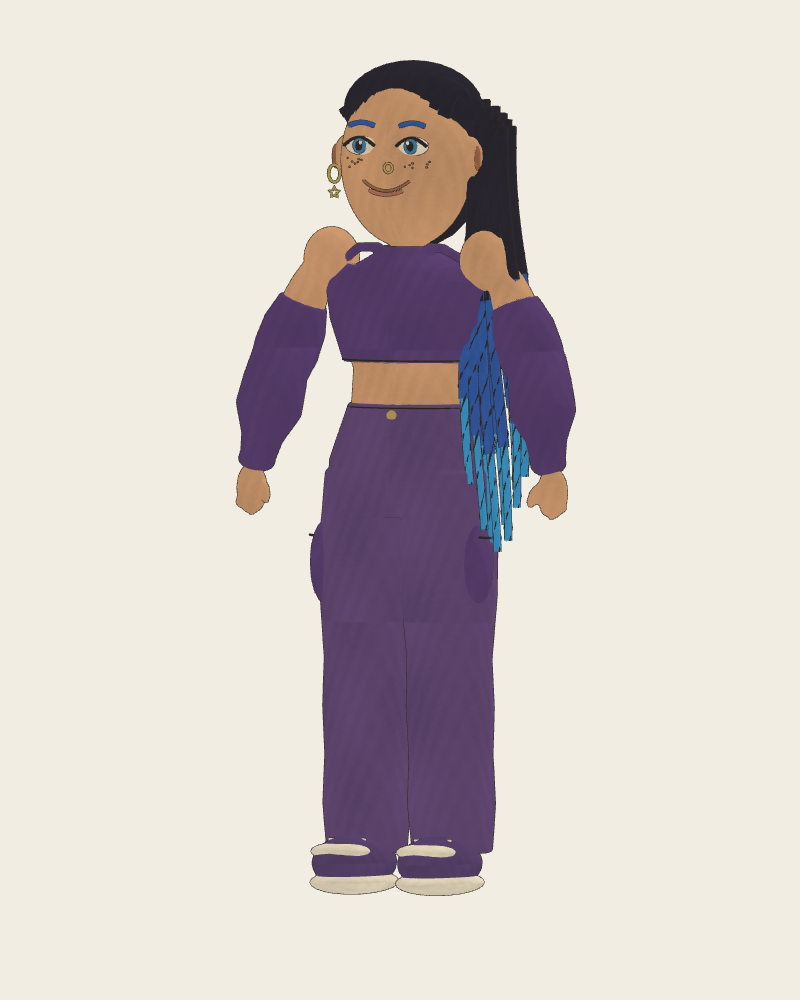
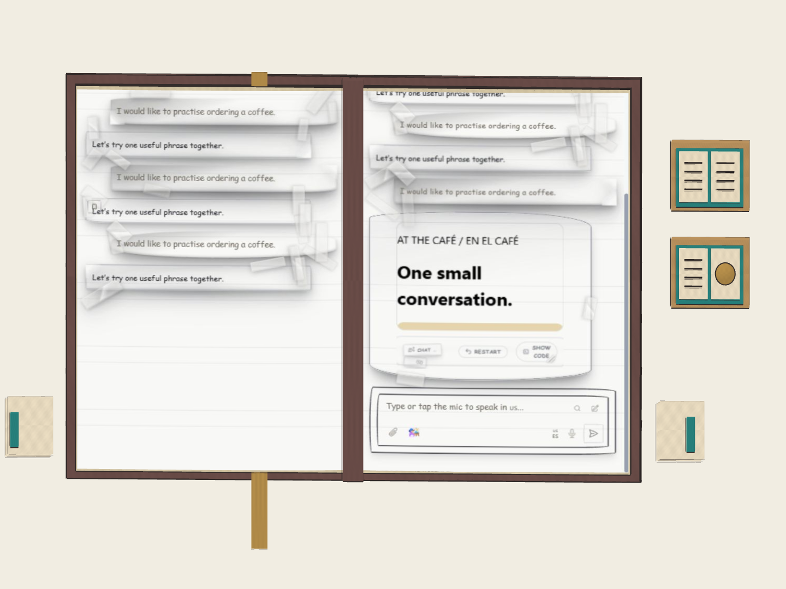

# Shared spatial pencil style

Accepted 2026-09-25: the default Maestro, physical book, scene objects, imported
models, and user-drawn objects should belong to the same Penzil-inspired world
as `D:/Projects/Games/Scetch-War`.

The later user-supplied cartoon reference is the character target, with permission
to simplify further. Keep blue-tipped braids and brows, freckles, gold hoop/star
jewelry, a purple cropped top with loose sleeves, cargo trousers and sneakers.
Use broad cartoon proportions and a simple drawn face. Avoid realistic skin,
wet eyes, skin pores, elaborate facial simulation or a lifelike human appearance.
The reference is sufficient; another drawing is optional, not a prerequisite.

Penzil is the visual reference: https://github.com/jacopocolo/Penzil. Its README
describes a Three.js/Vue spatial sketching app, currently paused. It is not a
Unity runtime dependency; this project does not copy its source or artwork.
Scetch-War also uses Penzil as a visual reference and supplies its own opaque
watercolor surfaces and spatial graphite geometry.

## Rendering contract

- Marks are actual three-dimensional paths, with pressure variation and tapered
  ends. They remain visible from the sides and back. User strokes use the same
  mesh construction and pigment palette as included artwork.
- Opaque, matte watercolor beneath graphite preserves contrast against the real
  room. Keep deliberate gaps between limbs, fingers and object handles.
- No glossy plastic shading, frame-random wobble, camera-facing model sprites,
  full-screen sketch filter, or triangle-wireframe treatment.
- Surface pigment uses a shared mipmapped texture. Coordinates and stroke
  variation are fixed to the object; skinned meshes retain rest coordinates so
  the pigment does not slide during animation. Both stereo eyes see the same marks.
- Included objects receive authored contours and sparse surface hatching.
  Imported meshes receive the common material and silhouette treatment; arbitrary
  shapes do not automatically acquire the quality of hand-authored contour paths.
- The page content remains the familiar Maestro interface. No extra book menus,
  counters or toolbar appear inside that page image. Extra interactive controls
  are physical objects outside it.

## Current assets and evidence

`unity/ArtSource/create_maestro.py` authors original full-body geometry, an
18-bone rig and idle/listening/speaking/greeting/pointing clips. The FBX and its
provenance live in the Unity Resources/Avatars directory. The generator's studio
renders verify geometry only. `QuestArtPreview.Render` now renders the actual
Unity pigment shader and samples each imported motion clip. Those are desktop
renders, not headset evidence. Facial motion, final contour authoring, character
likeness, animation deformation and hardware budgets remain release checks.

`PencilStrokeMesh` builds bounded physical graphite tubes. `PencilModelStyle`
applies the shared watercolor/silhouette treatment. The book pages opt out of
that treatment so their existing UI colors and text remain intact.

Current Unity desktop studies (development drafts, not release approval):

